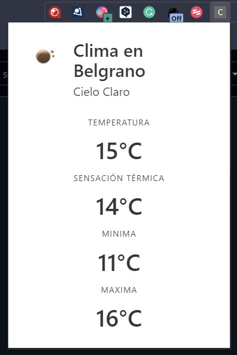

# ClimaChromeExtension
Weather Chrome extension to practice

To use it, get an API key from [OpenWeather](https://openweathermap.org/api) and replace it in ``` const API_KEY = 'YOUR OPENWEATHERMAP API KEY'; ``` in the script.js file

